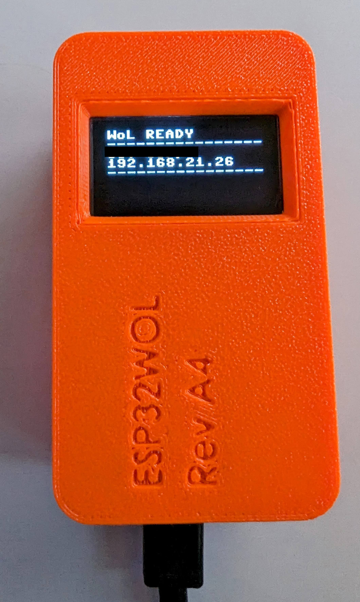

# Micropython WOL: a tiny Wake-on-Lan delegate

 

## What is Micropython-WOL?
Micropython-WoL is a firmware that enables Wake-on-lan functionality on tiny microcontrollers. This utility is written in python and runs on top of microptyhon. 

So far, this utility is compatible with the Expressif ESP32 and the ESP8266 devices.

This tool is suited for people who want to turn on their PC-devices via Wake-On-Lan,
but cannot do that using their current home gateways or have no domotic/server device
where to install such a service.

## Why ESP32/8266?
Both devices are a small, cheap, low-power and powerful.
This project turns those tiny chips into Wake-On-Lan service providers 
exposed via a self-hosted web-ui, which can be reached from all-over the internet. 

Of course, you might use other devices/servers to do the same thing.
But, if you don't have any, and you just need a small, power-efficient device to 
turn on you other devices on the network, the Micropython-WoL is what you are looking for.

Let's have a look at some possible alternatives in the following table.

|                     | ESP32-WoL    | Raspberry with HA | Home Server |
|---------------------|--------------|:-----------------:|------------:|
| Hardware cost       | < 10 USD     |     ~ 60 USD      |    100+ USD |
| Power consumption   | < 1 W        |       4~5 W       |      ~ 15 W |
| Occupied space      | 2 coins size | Credit card size  |   Mini ITX+ |
| Installation effort | Minimum      |      Medium       |        High |

In general, if you already have a home-server or a HomeAssistant device in your LAN,
then you probably don't need this firmware. 
However, there might be various cases in which this utility comes handy.
For instance, I needed to run WoL packets into different VLANs: my HomeAssistant device was 
not able to reach all the subnets segments (and the router correctly forbid magic packet broadcast across vlans). Thus, I've decided to implement this utility.

## Compatible Devices

I've tested the following devices:
- ESP8266 NodeMCU (CP2102)
- ESP32-WROOM

More micropython-enabled microcontrollers might be supported, but I haven't explicitly tested them.

## Flash instructions

The Micropython-WoL can be installed in two ways:
- Flashing a pre-compiled firmware **(recommended!)**
- Flashing the python source on the device

### Option A: Install by flashing the firmware
This method is the recommended way of flashing the firmware utility, but only supports a limited
number of hardware microcontrollers: ESP8266_GENERIC, ESP32_GENERIC_S2, ESP32_GENERIC_C3.

The firmware flash procedure is the following:

1. Download the latest firmware from the [release section of this repository](https://github.com/albertogeniola/Micropython-WoL/releases) or just [grab the latest](https://github.com/albertogeniola/Micropython-WoL/releases/latest).
2. Ensure you have the right OS serial port-drivers installed for your device (e.g. [CP210X](https://www.silabs.com/developers/usb-to-uart-bridge-vcp-drivers), [CH340](https://learn.sparkfun.com/tutorials/how-to-install-ch340-drivers/all), etc)
3. Ensure you have a valid python interpreter on your system and install esptool via the following command
    ```bash
    python -m pip install esptool
    ```
4. Run the appropriate flash command, based on your device.

    For the ESP8266, run the following
    ```bash
    python -m esptool --chip esp8266 --port SERIAL_PORT write_flash --flash_mode dio --flash_size detect 0x0 path/to/downloaded/firmware.bin
    ```

    For the ESP32, run the following
    ```bash
    python -m esptool -p SERIAL_PORT -b 460800 --chip esp32 write_flash 0x10000 path/to/downloaded/micropython.bin
    ```

    > Note: replace **SERIAL_PORT** with the name of the serial port where the device is connected (e.g. COM5). Also, remember to update the firmware path parameter so that it points to the downloaded firmware.

### Option B: Install by manual update
This installation method is the most general one, but requires you to install the latest micropython firmware on your own, and then upload the python source files directly into the controller.

Before proceeding with the installation, ensure you have flashed your microcontroller with a micropython firmware. [Here](https://micropython.org/download/esp32/) and [here](https://docs.micropython.org/en/latest/esp32/tutorial/intro.html#deploying-the-firmware) 
you find the official instructions to do so.

Now, proceed as follows:

- Download this repository
```bash
  git clone https://github.com/albertogeniola/Micropython-WoL
```

- Install python virtual env and dependencies
```bash
  cd Micropython-WoL
  python -m pip install virtualenv
  python -m venv .venv
  .\.venv\Scripts\activate # Or "source .venv/bin/activate" if running on linux
  python -m pip install -r requirements.txt
```

After that, we need to install the cross-compilation library (mpy-cross).
Retrieve the specific version of your micropython installed version (in this example was `1.22.1`) and install the corresponding mpy-cross package, as follows:

```bash
python -m pip install mpy-cross==1.22.1
```

Remember: if you using a different version of micropython, change the `1.22.1` parameter accordingly.

At this point, we can now perform the program upload. To do so, disconnect your ESP32 device and run the following command. 

Replace `_COM_PORT_NAME_OR_TTY_` with the serial port path/name of your ESP32 device. On Windows, they are usually `COMX` (where X is an integer); on Linux it is in the form of `/dev/ttyUSB0`

```bash
python upload_mpy.py _COM_PORT_NAME_OR_TTY_
```

Then, plug the ESP32 device via USB within 30 seconds: the flashing process will start. 

```
...
Pre-compiling ...
Pre-compiling ...
Pre-compiling ...
Uploading boot.py, main.py and hw.json
Waiting 30 seconds for pyboard ....
```

When you are done, the onboard device led should start blinking slowly: that means the device entered the "installation mode". If that's the case, you can proceed with the next section. If the led does not blink, it probably means some error occurred during the upload or flash process. You should start over and make sure to follow every step again.

## Configuration instructions
At this stage, the microptyhon-wol is ready to be configured! 

The first step is to use your laptop or smartphone to connect to the Access Point named "ESP_WOL" that the ESP32 sets up when it is in installation mode. Connect to that WIFI using the the following password: `espwol123`.

Once connected to the WiFi, open a browser and navigate to `http://192.168.4.1`. 
From that page, you will configure:
- The admin's password to log in to the ESP32 tool
- Your local WiFi SSID where the ESP32 should connect to
- Advanced network setup (static ip address for the ESP32)

*Note: you probably want to assign the ESP32 a static IP address.
You can do that via this web-ui or by configuring a DHCP static lease 
(or MAC-binding) at router/gateway/cpe level.* 

Once the form is submitted, the ESP32-WoL will reboot itself and attempt to connect
to the provided WiFi network, using the SSID and Password you provided via the form.
During this process, the onboard led will blink quickly. 

If the configuration fails, the device will reboot and put itself into installation mode
again. You will recognize that as the onboard led will start blinking slowly as it did 
before. If that happens, you should connect again to ESP_WOL wifi and start over the 
configuration.

On the contrary, if the ESP32 correctly connects to the target WiFi,
the onboard led will turn to FIXED-ON. When this happens, the web-ui should automatically redirect you to the ESP32-WoL web-administration page. If that does not happen, you can reach it by typing `http://<target_ip>` where `target_ip` is the IP address that the ESP32 device has been assigned via DHCP or has bound statically.
The ESP32_WOL will advertise its IP via bluetooth le. You can use the `BLE Scanner` android app to get this info: you jus need to launch the APP and scan for BLE device. You'll see an entry named `ESP32-WoL <IP_ADDRESS>`.

### Allow internet access to ESP32-WoL
In order to be functional to its original objective, the ESP32-WoL should be accessible
from internet. This means that you should:
- Make sure the ESP32 always gets the same IP on the LAN
- Enable port-forwarding from WAN IP to ESP32 internal IP, on TCP port 80 
- Optionally configure dynamic dns on your router device in case you have a dynamic external IP address from the ISP

Specific instructions on how to achieve such configuration objectives are out of the scope of this document, as every cpe/router device might differ. The internet is full of tutorials on how to do so, though. Just google for your router model and "how to port forward" o "how to static DHCP lease" and you should find some nice tutorial to help you out.

### Add WoL devices
If you made up to this stage, congratulations: you are done. 
It is now time to register the LAN devices you would like to wake up via the ESP32-WoL, so that you don't need to remember their MAC address by memory.

To do so, simply access the Web-UI of the ESP32-WoL at `http://mywol` o `http://<IP_OF_ESP32_WOL>`, log in with the admin password and add a new device. For a new device to be valid you must specify its mac address and a name. You could optionally set also its IP (in case it is static): if you do so, the ESP32-WoL will be able to check whether the target device is already ON or OFF.

*Note: if you don't specify the IP address of the target device, its "ON" or "OFF" status will be unreliable, but WoL packets will be delivered in any case, when you send them.*


## Advanced Topics
### API interactions
It is possible to interact with ESP32-WOL via REST APIs. You can find the API Open Specs in the `docs/swagger.yaml` file within this repository.
You can also test it directly via the nice swagger UI [from here](https://albertogeniola.github.io/ESP32-WoL/swagger).


### 3D printable case
This repository contains a STL model for 3D printing. 
The model is designed for the `JZK ESP-WROOM-32 ESP-32` ([available here on Amazon](https://p-nt-www-amazon-it-kalias.amazon.it/gp/product/B071JR9WS9/ref=ppx_yo_dt_b_search_asin_title?ie=UTF8&psc=1)).

The 3D printable model is designed to hold an oled display ssd1306 and has enough space for holding a small piezo-buzzer inside the case. 

<a href="docs/images/case-3d/front_green.jpg"></a>
<a href="docs/images/case-3d/composition.png"></a>
<a href="docs/images/case-3d/colored.png"></a>

You can find the 3D printable files on [ThingVerse](https://www.thingiverse.com/thing:6511323).


### Hardware Setup
TODO

### Configure wifi via config.json
TODO

## Some Screenshots
<a href="docs/images/login.png"></a>
<a href="docs/images/main.png"></a>
